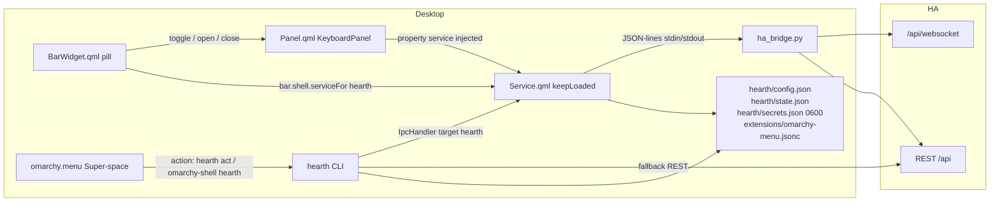
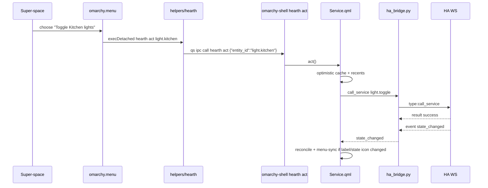

# Hearth — Omarchy plugin for Home Assistant

| Field | Value |
| --- | --- |
| **Title** | Hearth v0.1 Design |
| **Author** | Hearth / Omarchy plugin |
| **Date** | 2026-09-11 |
| **Status** | Draft |
| **Plugin id** | `hearth` |
| **Display name** | Hearth |
| **Version** | 0.1.0 |
| **Install** | `omarchy plugin add <repo-url> --enable --yes` |
| **Repo** | New git repository. Lives **alongside** (not inside) `/home/perry/18019-frigate`. No Frigate camera configs, Lovelace dashboards, or first-party `omarchy.hearth` merge. |

---

## Overview

Hearth is a third-party Omarchy (Quickshell) plugin that remote-controls one or more Home Assistant (HA) instances from the Linux desktop. v0.1 is a **bar pill + popup panel** in the Weather / Tailscale / Dropbox family, plus **instance-aware Omarchy menu entries** (Super-space) for rooms, favorites, recents, and instance switching. It is not a Lovelace clone, not a fullscreen overlay, and not a camera viewer.

The plugin is unsandboxed QML inside `omarchy-shell` (`kinds: ["service", "bar-widget"]`, `keepLoaded: true`). A long-running, unbuffered Python helper (a **new** pattern — not Dropbox's one-shot `status.py`) owns the HA WebSocket (Quickshell has no WebSocket client; `Quickshell.Io.Socket` is a Unix-domain `QLocalSocket`). Tokens live in `~/.config/omarchy/hearth/secrets.json` mode `0600`, written **only** by the helper — never in `shell.json` or in a QML `FileView`. Primary navigation is by HA Area; favorites and recents sit beside rooms; energy is shown only when HA Energy prefs resolve to at least one statistic id.

---

## Background & Motivation

Omarchy already hosts glanceable homelab chips (Weather, Tailscale, Dropbox) and a searchable command menu. Houses run Home Assistant; walking to a phone or a browser tab to toggle a light is the wrong surface for a Linux desktop that already has Super-space. First-party Omarchy will not ship HA integration (`omarchy.hearth` is a non-goal). A third-party plugin with id `hearth` can be installed, reviewed (git diff on update), enabled, and removed with the existing `omarchy plugin` tooling.

Pain points this release addresses:

- HA's own UI is a dashboard. DHH would hate a dashboard. Hearth is a **control surface**: rooms, a few favorites, recents, energy numbers if they already exist.
- Static `omarchy-menu.jsonc` cannot enumerate a user's rooms. Hearth must emit menu rows at runtime.
- Third-party plugins **do not** get `AuthServiceStore.js`. Hearth must store HA tokens itself.
- Houses with hundreds of entities are unusable as a flat dump. Navigation is Areas, plus a local allow-list.

---

## Goals & Non-Goals

### Goals (v0.1)

- Install as a git plugin with `manifest.json` at repo root, id `hearth`.
- One bar widget (default section `right`) that opens a `KeyboardPanel`.
- Dynamic Omarchy menu: current instance, rooms, favorites, recents, Open Hearth, Add Home Assistant.
- Control any **actionable** entity in the user's selected rooms (not lights-only).
- Onboard: URL + token **or** username/password; then Areas; then optional device subset.
- Auto-detect HA Energy prefs; hide energy UI entirely when absent.
- Multiple HA instances behind one pill; switcher in the panel header and menu.
- Reach any hostname/IP + port, http or https, including Tailscale MagicDNS and Nabu Casa. Warn on HTTP. Optional per-instance insecure TLS.
- After password login, never persist the password. Store a token.
- Optimistic toggles; reconcile from `state_changed`.
- Menu/CLI actions work with the **panel** closed (service `keepLoaded` + local cache). Taking the **pill off the bar** disables the plugin (`isEnabled` is presence in `shell.json`); menu then uses REST fallback only.

### Non-goals (v0.1)

- Full HA dashboard / Lovelace clone / fullscreen overlay
- Camera streams, Frigate viewer (even if this machine's workspace is Frigate configs)
- Voice / Assist
- Automations editor, scripts editor, YAML
- HA add-on / HACS install
- First-party merge into Omarchy (`omarchy.hearth`)
- Android / iOS
- Controlling devices outside the allow-list, except as specified for favorites
- MFA completion UI (fail clearly; tell the user to paste a long-lived token)
- Guessing `sensor.solar_*` names when Energy is unconfigured

---

## Key Decisions

| Decision | Choice | Rationale |
| --- | --- | --- |
| Plugin id | `hearth` (not `perry.hearth`, not `omarchy.hearth`) | Locked product name. `PluginRegistry.validateManifest` allows any id without `/`, `..`, or a leading `/`. Third-party ids in `/usr/share/omarchy/shell/README.md` are unprefixed author ids (`acme.weather`); a single-token id is valid and matches the install path `~/.config/omarchy/plugins/hearth/`. |
| Kinds | `["service", "bar-widget"]` + `keepLoaded: true` | Same pairing as `/usr/share/omarchy/shell/plugins/services/media/manifest.json`. The service owns WS connections and must survive panel close and plugin hot-reload of *other* plugins. `keepLoaded` services are not replaced on disk-save (`shell.qml` `unloadPluginServices`); Hearth service code changes require `omarchy restart shell`. |
| Desktop surface | Bar pill + panel **and** menu | User rejected bar-only. No fullscreen overlay. |
| WebSocket transport | Long-running Python helper (`helpers/ha_bridge.py`) spawned `python3 -u`; vendored RFC6455 | This machine has no `QtWebSockets` QML module (`qt6-websockets` is not installed). `Quickshell.Io.Socket` is a **local** socket (`QLocalSocket`), not RFC6455. Python `websockets` is **not** installed. Dropbox `status.py` is **one-shot**, not a daemon — do not copy that process model. Helper is unbuffered JSON-lines; PR 2 tests upgrade, max-frame, and TLS. |
| Menu dynamics | Prefix-mutate keys matching `/^hearth(\.|$)/` in `~/.config/omarchy/extensions/omarchy-menu.jsonc`; do **not** set `provider: "hearth"` | `Menu.qml` only implements hardcoded providers `fonts`, `power-profiles`, and native `apps`. Unknown `provider` is a no-op. Rewrite serializes JSON (user comments in that file are lost — documented tradeoff). Fail-closed: parse failure ⇒ do not write. Daily `.bak` in the same PR as the writer. |
| Secrets | Helper is the **only** writer of `~/.config/omarchy/hearth/secrets.json` (`os.open` `0o600`) | Omarchy has **no** plugin secret helper. `AuthServiceStore.js` is first-party only. QML must not `FileView` the secrets path (text would sit in the scene graph). `python-keyring` exists on this OS but depends on an unlocked session keyring. |
| Bar vs service lifetime | Enable = pill in `bar.layout`; removing the pill **disables** the keepLoaded service | `PluginRegistry.setEnabled` for a bar-widget only inserts the layout entry (`PluginRegistry.qml` 528–543); the `plugins[]` branch does not run when `isBarWidget`. Dual `plugins[]`+layout is unverified and `setEnabled(false)` only splices the **first** `findEntryLocation` (bar wins). Do not write `plugins[]` ourselves. Menu/CLI with the **panel** closed still has WS; menu with the **chip off the bar** is REST-only. |
| Post-password credential | Mint WS `auth/long_lived_access_token` (`client_name: "Hearth"`, `lifespan: 3650`). Fallback: persist `refresh_token` + `client_id`. Never store the password. | One credential type matches the paste-token path. Avoids 30-minute access-token refresh in the helper. User revokes "Hearth" from HA profile. Fallback covers HA builds that refuse LLAT mint. |
| Favorites | Hearth-local stars per instance, not HA frontend labels | HA's `entity_registry` has no clean public "starred" API comparable to the UI. Local stars survive HA frontend preference changes. |
| Allow-list vs later deselect | **Keep favorites** even if their room is later deselected. **Drop recents** that are no longer allowed. | A star is an explicit "I still want this on the desktop." Recents are a usage cache and should not resurrect a whole deselected room. |
| Unassigned entities | Include entities whose **resolved** `area_id` is in the selection. Offer an **Unassigned** bucket only if the user selected **All rooms**. | Avoids dumping integration leftover entities into "Kitchen". Unassigned is a real HA bucket and is only useful when the user opted into the whole house. |
| `allRooms` | `true` ⇒ at every connect, selected areas = all current registry areas + Unassigned. `false` ⇒ closed `selectedAreaIds` | Mirrors `includeAllEntities` for devices. A new HA area after save must appear without a Settings visit only if the user opted into the whole house. |
| Energy | Probe `energy/get_prefs`; hide on **any** failure, empty `energy_sources`, or zero resolved statistic ids. Parse nested `flow_from`/`flow_to` **and** flat `stat_energy_*`. Never guess entity ids. | Prefs are WS-only and were not live-probed on this machine. Grid is nested on common HA; flattening (if any) is not the only shape. `stat_rate` **or** `stat_power` is optional live W. |
| Multi-instance | One widget (`allowMultiple: false`). Instance switcher in panel + menu. | Matches "one pill." Multiple chips would fight the bar. |
| Active WS | Always-on for the **active** instance; lazy connect others on switch or menu act. | Keeps reconnect/ping cost to one house by default. |
| Plugin settings vs shell.json | Bar entry is `{ "id": "hearth" }` only. Private state in `~/.config/omarchy/hearth/`. | README storage rule 3 is for **widget** settings the shell schema knows about. Tokens must not land there. |

---

## Proposed Design

### Architecture

Hearth follows the **media** plugin's dual-kind shape (headless service + bar widget) and Weather's **nested Loader** for the panel (not Dropbox's `entryPoints.barWidget: Panel.qml`). The HA helper is a **new** long-running JSON-lines process, not Dropbox `status.py`.

```
~/.config/omarchy/plugins/hearth/          # git checkout, manifest.json at root
  manifest.json
  Service.qml                              # keepLoaded singleton: cache, IPC, THE only helper spawn
  BarWidget.qml                            # pill; loads Panel.qml; injects service
  Panel.qml                                # view over Service; no Process, no IpcHandler
  qml/
    Onboard.qml, RoomList.qml, EntityRow.qml, EnergyStrip.qml, SettingsPage.qml
  js/
    Config.js, Entities.js, Energy.js, Url.js, MenuSync.js
  helpers/
    ha_bridge.py                           # persistent WS + login_flow + REST + secrets writer
    rfc6455.py                             # vendored WS client
    hearth                                 # CLI: menu merge, act, status, uninstall-menu

omarchy-shell
  PluginRegistry  → discovers ~/.config/omarchy/plugins/hearth/manifest.json
  _syncServices   → createObject(null) Service.qml  (third-party: no visual parent)
  BarWidgetRegistry → BarWidget.qml in bar.layout.right
  PluginShellApi  → serviceFor("hearth") only; no AuthServiceStore

Home Assistant
  GET /api/  |  POST /auth/login_flow  |  POST /auth/token
  ws(s)://<host>/api/websocket
```



Host injection (from `/usr/share/omarchy/shell/README.md` and `shell.qml`):

- Service and **bar-widget entry** may declare `omarchyPath`, `shell`, `manifest`, `pluginRegistry`, `barWidgetRegistry`. Nested `Panel.qml` loaded via `Qt.resolvedUrl` does **not** receive host injection (Weather's `injectPanel()` only copies `bar`, `settings`, `anchorItem`, `hostWidget`).
- Under the **built-in** bar, a third-party widget gets `pluginShellFor(manifest)` with `allowOwnService: true`. `bar.shell.serviceFor("hearth")` then returns the keepLoaded instance (`pluginOwnsTarget` is self-id only). Media's `bar?.shell?.firstPartyServiceFor("omarchy.media")` is **first-party-only** and must not be copied.
- A third-party **replacement bar** gets a service-less entry facade (`pluginShellForBarEntry`); the Hearth pill will not resolve `serviceFor` (accepted, same as Media).
- Visual plugins share the host QML scene; tokens must not sit on QML `property string` or in `FileView` text. The helper holds them in RAM and on `secrets.json`.

### Manifest

```json
{
  "schemaVersion": 1,
  "id": "hearth",
  "name": "Hearth",
  "version": "0.1.0",
  "author": "Hearth",
  "license": "MIT",
  "description": "Remote-control Home Assistant from the Omarchy bar and menu.",
  "kinds": ["service", "bar-widget"],
  "keepLoaded": true,
  "entryPoints": {
    "service": "Service.qml",
    "barWidget": "BarWidget.qml"
  },
  "barWidget": {
    "displayName": "Hearth",
    "description": "Home Assistant rooms, favorites, and energy at a glance.",
    "category": "Home",
    "allowMultiple": false,
    "defaultSection": "right"
  }
}
```

Notes against `/usr/share/omarchy/shell/services/PluginRegistry.qml`:

- Required fields: `schemaVersion` (must be `1`), `id`, `name`, `version`, `kinds`, `entryPoints`.
- `entryPoints.barWidget` / `service` are relative paths; `..` and absolute paths are rejected.
- Enabling a third-party bar-widget inserts `{ "id": "hearth" }` into `bar.layout.<defaultSection>` (`right`) only. The `config.plugins.push` branch in `setEnabled` does **not** run when `isBarWidget` is true (`PluginRegistry.qml` 528–543). `_syncServices` mounts `Service.qml` iff `isEnabled` (id present somewhere in `shell.json`) — in practice, while the chip is in the bar.
- Removing the widget from the bar (or `omarchy plugin disable hearth`) makes `isEnabled` false and **destroys** the keepLoaded service. Super-space `hearth act` then uses the CLI REST fallback (needs `secrets.json`). Product requirement is menu with the **panel** closed, not with the plugin off the bar.
- Do **not** also write `{ "id": "hearth" }` into `plugins[]`. Dual location is untested; `findEntryLocation` returns the bar match first, so `setEnabled(false)` would leave a stale `plugins[]` row (or the inverse, depending on who wrote what).
- Do **not** set `omarchy.capabilities: ["authentication"]`. That stamp is first-party only (`trustedCapabilities` returns `[]` for third-party).

### Bar widget (weather **contract**, not a literal copy)

Follow `/usr/share/omarchy/shell/plugins/panels/weather/BarWidget.qml` for the **summon shape**, but **do not** copy `visible: panelLoader.item && panelLoader.item.label !== ""`. That line hides Weather until `label` is non-empty; Hearth's first-run pill must show immediately as dimmed `"Hearth"`.

- `BarWidget { moduleName: "hearth" }` — **must equal plugin id** so `Bar.findPanelWidget("hearth")` matches `slot.moduleName`
- `visible: true` always (implicit width from the button, never collapse to 0)
- Hidden `Loader { source: Qt.resolvedUrl("Panel.qml") }`
- `injectPanel()` sets `bar`, `settings`, `anchorItem`, `hostWidget`, **and** `service` (Weather does not inject `service`/`shell`)
- Resolve the singleton once:

```qml
readonly property var svc: bar && bar.shell ? bar.shell.serviceFor("hearth") : null
```

  Re-inject on `onLoaded`, `onBarChanged`, and `onSvcChanged`. There is **one** keepLoaded Service and **one Panel Loader per monitor**; Panel must not spawn `ha_bridge.py`.
- Expose `opened`, `open()`, `close()`, `closeForPopoutSwitch()`, `popoutSwitchClosing` on the **BarWidget root** (`Bar.qml` 726–741). Dropbox skips this because its `entryPoints.barWidget` **is** `Panel.qml`.
- Pill is `BarIconButton`, **not** a custom control
- Left-click: `togglePanel()`. Middle-click: `svc.refresh()` if present. Right-click: optional `omarchy-notification-send` of instance status
- Summon path: `omarchy-shell shell summon hearth` → `isBarWidgetPanelPlugin` → `bar.summonBarWidget("hearth")` → `open()` / `openFromHotkey()`

**Disconnected / no-service pill:** hearth/house Nerd Font glyph (`󰋜`) + label `Hearth`, color `Qt.darker(bar.barForeground, 1.55)` (Dropbox's dimming). Do **not** also set `opacity: 0.6` — one dimming rule.

**Connected pill, in order** (from `svc.pillLabel` / `svc.connected`; fallback `"Hearth"` if `svc` is null):

1. If energy prefs expose a live **power** entity (W) and it is available → `1.2 kW` (1 decimal kW if ≥ 1000 W, else integer W).
2. Else if the allow-list has any `light`/`switch`/`fan`/`input_boolean` currently `on` → `3 on`.
3. Else hearth glyph + `"Hearth"` (no empty `"0 on"`).

Target: pill text from **local cache**, no HA round trip.

### Panel

`Panel.qml` uses `qs.Ui.Panel` + `KeyboardPanel` + `PanelKeyCatcher` like `/usr/share/omarchy/shell/plugins/panels/dropbox/Panel.qml` and weather. It is a **view**: `property var service: null` injected by BarWidget. No `Process`, no helper, no secrets.

- `moduleName: "hearth"`
- `manageIpc: false` (disables the **base** `qs.Ui.Panel` handler)
- **No** `IpcHandler` in Panel.qml. **No** `ipcTarget: "hearth"`. Weather/Dropbox each declare `IpcHandler { target: root.ipcTarget }`; copying that would collide with Service's `target: "hearth"` (undefined dual handlers). All IPC lives on Service.
- `onOpenedChanged`: `service.refreshEnergy()` if present, `keyCatcher.forceActiveFocus()`, reset `cursorActive`
- `openFromHotkey` / `setCenterHoverRevealSuppressed` copied from weather so center-bar hover reveal stays consistent
- `contentWidth`: `panel.fittedContentWidth(Style.space(420))`
- `contentHeight`: cap ~`Style.space(560)` with `Flickable` (Dropbox)
- Colors: `bar.foreground`, `Color.accent`, `Style.hoverFillFor`, `Style.space`, `Style.font.*`. No custom palette. There is no kit "segmented control"; Token vs Username uses `qs.Ui.ButtonGroup`.

**Keyboard (Dropbox conventions):**

| Key | Action |
| --- | --- |
| Arrows / `hjkl` via `onMoveRequested` | Move cursor; first motion only reveals cursor |
| Enter / `onActivateRequested` | Activate focused control |
| Esc / `onCloseRequested` | Close panel |
| Tab / `onTabRequested` | `bar.switchPanelFrom` (adjacent bar panels) |
| `/` | Focus in-panel filter (rooms/entities) |
| `f` | Toggle favorite on focused entity |
| `1` / `2` / `3` | Recents / Favorites / Rooms |
| `s` | Settings |
| `n` | Add instance (header) |
| `r` | Refresh |

Onboard fields use `qs.Ui.TextField` with `PanelKeyCatcher.blocked: true` while focused (dev-gallery rule). Toggles use `qs.Ui.Toggle`. Auth method uses `qs.Ui.ButtonGroup` (Token | Username & password).

### Service

`Service.qml` is an `Item` created with **no visual parent** (`shell.qml` `ensureService`: third-party `createObject(null)`). It is the **only** component that spawns `ha_bridge.py` (one process, not one per monitor).

1. Ensures `~/.config/omarchy/hearth/` (`Process` `mkdir -p`, mode `0700`).
2. Loads `config.json` and `state.json` via `FileView` (`atomicWrites: true`, same as notifications). **Does not** `FileView` `secrets.json`.
3. Spawns the helper as a long-lived `Process`:

```qml
command: ["python3", "-u", helperPath]   // -u / PYTHONUNBUFFERED=1; stdout is block-buffered otherwise
stdinEnabled: true
```

   Protocol: **one JSON object per line**. Cap **control-plane** lines (commands, `result`, `connection`, `state_changed` for a single entity) at **256 KiB**; drop and `console.warn` oversize. **Do not** put `get_states` / registry dumps on this pipe. After any `process.write` that carried a pasted token or password, **clear** the QString immediately. `Process.write(QString)` and `stdinEnabled` exist (`quickshell-io.qmltypes`); first-party usage is otherwise one-shot (Dropbox) or a single password write (network enterprise). This is a **new** pattern.
4. `Process.onExited` → restart with the same backoff as WS reconnect (1s, 2s, 5s, 10s, 30s cap). Pill goes dim while down.
5. Entity index: helper writes `~/.cache/omarchy/hearth/entities/<instanceId>.json` (5000-cap applied **in the helper** after hide-filters) and emits a small `{"event":"snapshot","instanceId":"...","path":"...","entityCount":N}` line. QML `FileView`s that cache path (no tokens in it) or reads it via a follow-up helper `{"cmd":"read_snapshot","instanceId":"..."}` that still must not exceed the 256 KiB line cap — so **FileView the cache file**, do not echo the dump on stdout. Incremental `state_changed` events stay on the pipe (one entity per line).
6. Debounces menu rewrite (250 ms) after rooms/favorites/recents/instance changes; skip write if `menu-etag` matches.
7. Registers the **sole** `IpcHandler { target: "hearth" }` (media: `target: "media"`). `omarchy-shell` forwards arbitrary targets (`qs ipc … call -- hearth act …`).

**Do not rely on `omarchy-shell shell call hearth ...`.** `shell.callIfLoaded` only dispatches to **panel / overlay / menu** loaders (`panelEntries` in `shell.qml`), not services.

Quickshell IPC methods are **string / number / bool only**. Signatures (payloads are JSON **strings**):

```qml
IpcHandler {
  target: "hearth"
  function status(): string { return root.statusJson() }
  function act(payload: string): string { return root.actJson(payload) }
  function setActive(id: string): string { return root.setActiveId(id) }
  function listInstances(): string { return root.listInstancesJson() }
  function testConnection(payload: string): string { return root.testConnectionJson(payload) }
  function completeOnboard(payload: string): string { return root.completeOnboardJson(payload) }
  function toggleFavorite(payload: string): string { return root.toggleFavoriteJson(payload) }
  function setSelection(payload: string): string { return root.setSelectionJson(payload) }
  function menuSync(): string { return root.menuSyncNow() }
  function reload(): string { return root.reloadFiles() }
  function openPanel(): string {
    return (root.shell && root.shell.summon("hearth", "{}")) ? "ok" : "error"
  }
}
```

`openPanel` uses the facade `_summon` (self-id is allowed). Do not add `kind: "panel"` in v0.1.

### Helper process (`helpers/ha_bridge.py`)

**Not Dropbox-like.** `/usr/share/omarchy/shell/plugins/panels/dropbox/status.py` is a one-shot `python3 helper 25` that prints JSON and exits. Hearth's helper is a **long-running JSON-lines daemon** (new pattern). Python 3, no plugin install hooks, no pip deps in v0.1.

Spawn: `python3 -u helpers/ha_bridge.py` (unbuffered). Every stdout line is `print(..., flush=True)`. Stderr is logs only (never tokens).

stdin commands (examples):

```json
{"cmd":"connect","id":1,"instanceId":"home"}
{"cmd":"login","id":2,"instanceId":"home","url":"...","username":"...","password":"...","tlsInsecure":false}
{"cmd":"login","id":2,"instanceId":"home","url":"...","token":"...","tlsInsecure":false}
{"cmd":"forget","id":5,"instanceId":"home"}
{"cmd":"call","id":3,"instanceId":"home","type":"call_service","payload":{"domain":"light","service":"toggle","target":{"entity_id":"light.kitchen"}}}
{"cmd":"disconnect","id":4,"instanceId":"home"}
```

`connect` carries **no token**. Helper reads `secrets.json` **`instances[instanceId]`** and uses `url` / `tlsInsecure` from `config.json` (it may re-read those files). Optional `url`/`tlsInsecure` on `connect` are allowed only as non-secret overrides already in config. `connect` **fails** if that secrets key is missing.

`login` **requires** `instanceId` (same slug that will land in `config.instances[].id`). It is the **only** command that may include a pasted token or password. Service writes that one line, then immediately `connectLine = ""`. Helper on success writes `secrets.instances[instanceId]` (merge: other instance keys untouched), may open the WS for `get_config`, and returns a **redacted** result (below). Never send `cmd: connect` with `"token"`.

`forget` deletes `secrets.instances[instanceId]` (and disconnects that id). Used when onboard is cancelled after a successful Test connection so a token is not left keyed under an instance that never made it into `config.json`.

stdout events:

```json
{"event":"result","id":1,"ok":true,"data":{"instanceId":"home","kind":"llat","hasToken":true,"haVersion":"2025.8.0","locationName":"Home"}}
{"event":"snapshot","instanceId":"home","path":"/home/u/.cache/omarchy/hearth/entities/home.json","entityCount":128,"areaCount":6}
{"event":"state_changed","instanceId":"home","entity":{}}
{"event":"connection","instanceId":"home","state":"connected","haVersion":"2025.8.0"}
{"event":"log","level":"warn","message":"..."}
```

**No `accessToken` / `refreshToken` / `password` on any stdout line consumed by QML.** `data` on login/connect `result` is `{ ok, instanceId, kind, hasToken, haVersion, locationName }` only.

WebSocket client: vendored RFC6455 in `helpers/rfc6455.py` (no `python-websockets` on this OS). Requirements for PR 2:

- HTTP/1.1 upgrade: `Connection: Upgrade`, `Upgrade: websocket`, `Sec-WebSocket-Version: 13`, random `Sec-WebSocket-Key`; accept only HTTP **101** with a matching `Sec-WebSocket-Accept`. Reject extra extensions (`permessage-deflate` not offered, not accepted).
- Client frames **masked**. Text frames only for HA JSON. Reject binary, RSV bits, and fragmented/continuation frames. **Max inbound frame 32 MiB** (HA `get_states` / registry lists are **one** text message; a few hundred entities already exceed 1 MiB). Reject anything larger as unbounded. Do **not** use the 256 KiB JSON-lines cap as the WS frame cap.
- TCP keepalive optional; Nagle: `TCP_NODELAY`.
- TLS: `ssl.create_default_context()` with SNI = hostname. `tlsInsecure` is the **only** path that uses `CERT_NONE` + no hostname check.
- Close: send a close frame on disconnect; map close codes to `connection` events.
- **Do not** send HA `supported_features` / `coalesce_messages`. The reader assumes one JSON object per WS message, not batched arrays.
- HA application keepalive: every 30 s send `{"id":n,"type":"ping"}`; expect `{"id":n,"type":"pong"}` (server pong — not a client `type:pong`).
- Reconnect with exponential backoff 1s, 2s, 5s, 10s, 30s (cap 30s). Reset backoff on `auth_ok`.

A buggy vendor can wedge the keepLoaded service inside `omarchy-shell`; PR 2 must include upgrade tests, **32 MiB** oversized-frame rejection (accept 2 MiB fixtures, reject >32 MiB), and TLS `CERT_NONE` only when `tlsInsecure`. Optional `python-websockets` later is documented, not v0.1.

On connect (active instance), helper (not QML) using the token from `secrets.json`:

1. `auth` with access token
2. `get_config` — `location_name`, `version`, `time_zone`
3. `config/area_registry/list`
4. `config/device_registry/list`
5. `config/entity_registry/list` (full, for `area_id` / `hidden_by` / `entity_category` / `disabled_by`)
6. `get_states`
7. Apply hide-filters + entity-id regex + **5000 cap in the helper**; write `~/.cache/omarchy/hearth/entities/<instanceId>.json`; emit `snapshot` (path + counts only)
8. `subscribe_events` `event_type: state_changed`
9. Probe `energy/get_prefs` (see Energy)

Helper **never** logs tokens and **never** echoes them to QML. It is the **only** writer of `secrets.json` (`os.open(path, os.O_WRONLY|os.O_CREAT|os.O_TRUNC, 0o600)` then `os.replace` from a tempfile created with `0o600`). RAM copy is for the WS only.

### URL normalization

User types `homeassistant.local:8123`, `192.168.1.50`, `https://xxx.ui.nabu.casa`, `http://ha.tailscale.ts.net`.

Rules (`js/Url.js`):

| Input | Result |
| --- | --- |
| no scheme | `http://` + host; default port **8123** if omitted |
| `http://host` no port | port **8123** |
| `https://host` no port | port **443** (Nabu Casa / reverse proxy) |
| explicit port | keep |
| IPv6 | require brackets in the typed URL (`[fd12::1]:8123`); store as `http://[fd12::1]:8123` |
| path | **stripped to origin**. v0.1 does **not** support HA-on-a-subpath (`https://gw.example/ha/`). Document this; "any host" means hostname/IP, not a path prefix. |
| scheme `http` | set `plaintextHttp: true`; onboard blocks **Connect** until the user checks **I understand this is unencrypted** (`httpAcknowledged`) |
| `tlsInsecure` | only shown for `https`; default false. If host matches `*.ui.nabu.casa` (case-insensitive), hide the checkbox on onboard and require a second confirmation in Settings copy: "Nabu Casa already has a public CA cert. Allowing insecure TLS here is almost certainly a mistake." Default remains false. |

Health check (reachability, **not** "is this HA authenticated"):

- With a token: `GET {origin}/api/` + `Authorization: Bearer` — success is HTTP 200 and JSON `{"message":"API running."}` (official REST docs).
- Without a token: `GET {origin}/api/` — **HTTP 401 is success for reachability**. Do **not** require the `API running.` body (REST docs lock `/api/` behind Authorization). Other failures (connection refused, TLS, timeout, 404 HTML from a random host) are connection errors.
- `GET {origin}/auth/providers` (unauthenticated, as HA frontend `fetchAuthProviders`) confirms it is HA before offering password login. Not live-probed on this machine. **Accept either** a top-level JSON **array** (legacy comment in core) **or** an object `{ "providers": [ ... ], "preselect_remember_me": ... }` (current `IndieAuthProvidersView`). Normalize to the `providers` list. Non-JSON / HTTP error / missing list ⇒ treat as "not HA" for the **password** path only; keep Token. Do **not** require a top-level array — that would hide Username & password on every stock HA.

---

## First-run UX

1. Plugin enabled → pill appears immediately, dimmed, label `Hearth`.
2. Click / summon → panel opens **Onboard**, not an empty room list.
3. Fields:
   - **Name** — default `Home`
   - **URL** — placeholder `homeassistant.local:8123`
   - **Auth** — `qs.Ui.ButtonGroup` **Token | Username & password** (token is first-class, default). Hide Username & password unless `/auth/providers` includes `type === "homeassistant"`. Do **not** treat `trusted_networks`, `command_line`, or any other type as a password provider.
   - Token: `TextField { password: true }` (dev-gallery)
   - Username / password: two fields; password `password: true`
   - HTTPS self-signed: checkbox **Allow insecure TLS (this instance)** (hidden for `*.ui.nabu.casa` on first run)
   - HTTP: warning copy + acknowledgement checkbox
4. **Test connection** (disabled until URL + credential + acknowledgements). **Before** the helper `login` line, QML assigns a **pending instance id** (non-secret): slug of Name (`Home` → `home`) plus a numeric suffix if that id already exists in `config.instances[]` (`home-2`). Keep it on `property string pendingInstanceId` (not a token). Send:

   `{ "cmd": "login", "id": n, "instanceId": pendingInstanceId, "url": "...", "tlsInsecure": false, "token"|"username"+"password": "..." }`

   then clear the credential QString. Helper writes `secrets.instances[pendingInstanceId]` and returns `{ ok, instanceId, kind, hasToken, haVersion, locationName }`. On success show **HA version** and **location name**. On failure, show the helper error (connection refused, TLS, `auth_invalid`, IndieAuth public IP, MFA — see Auth); do **not** keep a secrets key on failed login. Editing Name after a successful test does **not** change `pendingInstanceId` (the secrets key is already that id; Name is only a label in `config.json`).
5. **Rooms** — checklist of areas from `config/area_registry/list`, plus **All rooms**. Default: none selected until the user picks (no surprise whole-house dump). Selecting All rooms checks every area, sets `allRooms: true`, and enables Unassigned. Deselecting any area sets `allRooms: false` and stores the remaining ids as a **closed** `selectedAreaIds`.
6. **Devices (optional)** — grouped by area. Default: all **actionable** entities in selected areas checked. User may uncheck. Persistence: if every actionable entity in the selected areas remains checked, store `includeAllEntities: true` so newly added bulbs in Kitchen appear later; if the user unchecked any, store `selectedEntityIds` as a **closed allow-list** (new devices in those rooms do **not** appear until Settings → devices).
7. **Save** writes `config.json` with `instances[].id === pendingInstanceId` (same slug as the secrets key), sets `activeInstanceId` to that id, then `{ cmd: "connect", instanceId: pendingInstanceId }` (no token). Probes energy (no energy wizard), syncs menu, shows the connected panel. **Cancel / close onboard without Save:** `{ cmd: "forget", instanceId: pendingInstanceId }` so the helper deletes `secrets.instances[pendingInstanceId]` and disconnects. Do not leave a token on disk for an instance that never entered `config.json`. Settings → replace credentials reuses the **existing** instance id on `login`.

Skip energy setup. If prefs exist, the strip appears on the next frame.

---

## Connected panel UX

```
┌─────────────────────────────────────────────┐
│  Home  ●  ▾          +                      │  header
│  ☀ 12.4 kWh   ↓ 3.1   ↑ 8.8                 │  energy (optional)
│  Recents   Favorites   Rooms                │  tabs
│  ─────────────────────────────────────────  │
│  Kitchen                                    │
│  Hall                                       │
│  …                                          │
└─────────────────────────────────────────────┘
```

**Header:** instance name, connection dot (green connected / amber reconnecting / red failed), instance switcher (`▾` list of names), `+` add instance (same onboard flow: new `pendingInstanceId` → `login` → Save/`connect` or Cancel/`forget`).

**Energy strip:** only if prefs probe resolved **at least one** statistic id (see Energy). Three numbers for **today** (local HA timezone from `get_config.time_zone`): solar generated, grid imported, grid exported. Hide any **column** whose statistic ids are missing; hide the **whole strip** if none resolved. Refresh every **10 minutes** and on panel open.

**Body tabs:** Recents | Favorites | Rooms.

- **Rooms:** list of selected areas (sorted by HA `name`). Opening a room lists actionable allow-listed entities, sorted by `friendly_name`. Each row: name, state, primary control.
- **Favorites:** Hearth stars, including starred entities whose room was later deselected. Empty state: "Star a device from a room."
- **Recents:** last **12** successfully acted-on entity ids, newest first, **filtered to current allow-list**. Empty: "Act on a device to see it here."

**Settings** (gear on header or `s`): re-run area/device subset, edit URL, replace credentials (token or user/pass — password not stored), TLS insecure toggle (extra confirm on `*.ui.nabu.casa`), HTTP acknowledgement, remove instance (confirm). Removing the last instance returns to onboard.

**Optimistic UI:** toggle immediately flips local state and `pending: true`. On `state_changed` matching entity, clear pending and take HA state. On `call_service` error or 2 s timeout without event, revert and flash `lastError` on the row.

---

## Auth flows

### Token (paste long-lived access token)

User creates a token in HA Profile → Long-lived access tokens, pastes it. Helper `connect`s WS:

```
server: {"type":"auth_required","ha_version":"..."}
client: {"type":"auth","access_token":"<llat>"}
server: {"type":"auth_ok","ha_version":"..."}  |  {"type":"auth_invalid","message":"..."}
```

REST equivalent: `GET /api/` with `Authorization: Bearer <token>` → `{"message":"API running."}` — performed **inside the helper** on `login`, not by QML.

Helper stores `{ "accessToken": "...", "kind": "llat" }` in `secrets.json`. QML only sees `{ kind: "llat", hasToken: true }`. No expiry handling beyond `auth_invalid` → mark instance **needs reauth**, keep cache read-only, pill dimmed.

### Username & password

HA does **not** accept user/pass on the WebSocket (`access_token` only). Use the auth manager login flow, then mint a token.

```mermaid
sequenceDiagram
  participant U as Panel onboard
  participant S as Service.qml
  participant H as ha_bridge.py
  participant HA as Home Assistant
  U->>S: testConnection(name, url, user, pass, tlsInsecure)
  S->>S: pendingInstanceId = slug(name) or slug-2 if taken
  S->>H: {"cmd":"login", instanceId: pendingInstanceId, url, username, password} (then clear QString)
  H->>HA: GET /auth/providers
  HA-->>H: {"providers":[{"type":"homeassistant","id":null}, ...], "preselect_remember_me":false}
  Note over H: list = body.providers || body if array\nhandler = first type===homeassistant [type, id]\nIf none, hide password path
  H->>HA: POST /auth/login_flow {client_id, handler, redirect_uri}
  HA-->>H: {type:form, step_id:init, flow_id, data_schema:[username,password]}
  H->>HA: POST /auth/login_flow/{flow_id} {client_id, username, password}
  alt MFA / extra form
    HA-->>H: {type:form, step_id: not init}
    H-->>S: {ok:false, error:mfa_required}
    S-->>U: "This account needs MFA. Create a long-lived token in your HA profile and paste it."
  else create_entry
    HA-->>H: {type:create_entry, result:"<auth_code>"}
    H->>HA: POST /auth/token grant_type=authorization_code
    HA-->>H: {access_token, refresh_token, expires_in}
    H->>HA: WS auth with access_token
    H->>HA: WS auth/long_lived_access_token {client_name:Hearth, lifespan:3650}
    alt LLAT minted
      HA-->>H: result: "<llat>"
      H->>H: write secrets.instances[instanceId] 0600 (llat)
    else mint failed
      H->>H: write secrets.instances[instanceId] 0600 (refresh_token + client_id)
    end
    H-->>S: {ok:true, instanceId, kind, hasToken:true, haVersion, locationName}
    S-->>U: success; discard password from RAM
  end
  Note over U,S: Save: config.instances[].id = pendingInstanceId then connect(instanceId)
  Note over U,S: Cancel: forget(pendingInstanceId) deletes that secrets key
```

**client_id / redirect_uri:** the HA origin with trailing slash, e.g. `http://homeassistant.local:8123/`. Field name is `redirect_uri` (HA login_flow; some core comments still say `redirect_url`). IndieAuth `client_id` must be a URL; **public IPs are rejected** (HA: only RFC1918 / loopback IPs allowed as client_id). Username/password onboard to `http://203.0.113.10:8123` therefore fails even with HTTP ack; **token paste still works**. Some MagicDNS hostnames may also fail IndieAuth — same fallback. If `/auth/login_flow` returns 400 `invalid client id`, the UI says so and points at the token path. We do **not** host a public OAuth client page in v0.1.

**Providers:** `GET /auth/providers` (frontend `fetchAuthProviders`; not live-probed here). Current core (`IndieAuthProvidersView`) returns an **object** `{ providers: [...], preselect_remember_me }`. A stale comment in `login_flow.py` still shows a bare array — accept both: `list = Array.isArray(body) ? body : body.providers`. Prefer `type === "homeassistant"` as the password handler (`handler = [type, id]`). Do **not** use `trusted_networks` or `command_line`. If the list has no `homeassistant`, hide the password ButtonGroup and force Token. Non-JSON / HTTP error ⇒ token path only (do not treat a valid object as "not HA").

**Password / pasted-token lifetime:** exists only in the onboard field and the single `login` JSON line. After `write()`, Service sets that string to `""` and does not stash `testConnection` / `completeOnboard` IPC results that could contain secrets (those results must not contain secrets). Helper writes `secrets.instances[instanceId]` and forgets the password. Subsequent `connect` is `{ cmd, id, instanceId }` only — that id **must** be the one generated before `login` and written into `config.instances[].id` on Save. Do not hold the token in QML to delay the secrets write.

**Refresh-token fallback:** helper refreshes via `POST /auth/token` `grant_type=refresh_token` when WS gets `auth_invalid` or 1 minute before `expires_in`. Store `clientId` alongside the refresh token (must match the login client_id).

**MFA:** if `type === "form"` after password and `step_id !== "init"`, or schema is not username/password, abort (`mfa_required`). Do not special-case `step_id: totp` — MFA modules vary. Do not hang waiting for a TOTP we will not collect in v0.1.

---

## Entity / area model

### Resolution

```
effectiveDeviceArea(device):
  device.area_id
    ?? (device.parent_device_id ? effectiveDeviceArea(parent) : null)

entity.area_id
  ?? effectiveDeviceArea(device_by_id[entity.device_id])
  ?? null   // unassigned
```

HA child devices (`parent_device_id`) with a null `area_id` inherit the parent device's area (`dr.async_get_effective_area_id`). v0.1 **does** one-level-or-walk parent lookup with a visited-set to avoid cycles. Entities that still resolve null are Unassigned (only listed if `allRooms`).

Use `config/entity_registry/list` (not only `list_for_display`) so we still see `hidden_by` / `disabled_by` / `entity_category` to **filter them out**. `list_for_display` already drops disabled entities and abbreviates keys (`ei`, `ai`, `di`, `ec`, `hb`); the full list is simpler for v0.1.

**Runtime allow-list:**

- `allRooms: true` ⇒ at every connect / area-registry refresh, selected set = all current `area_id`s + Unassigned. New HA areas appear without a Settings visit.
- `allRooms: false` ⇒ closed `selectedAreaIds` from onboard/Settings. New rooms only via Settings.
- `includeAllEntities: true` ⇒ all actionable entities whose resolved area is in the selected set (including new devices in those rooms).
- `includeAllEntities: false` ⇒ closed `selectedEntityIds`.

Hide by default:

- `disabled_by != null`
- `hidden_by != null` (user or integration)
- `entity_category` in `config`, `diagnostic`
- domains not in the actionable table
- entities not in the allow-list (except favorites — see Key Decisions)

### Actionable domains (v0.1)

| Domain | Primary control | Service call | v0.1 |
| --- | --- | --- | --- |
| `light`, `switch`, `fan`, `input_boolean`, `siren` | Toggle | `{domain}.toggle` | yes |
| `scene`, `script`, `button`, `automation`, `input_button` | Activate | `turn_on` / `press` (`button`/`input_button` → `press`) | yes |
| `cover`, `valve` | Open / Close / Stop | `open_cover` / `close_cover` / `stop_cover` (valve: `open_valve` …) | yes |
| `lock` | Lock / Unlock | `lock` / `unlock` | yes |
| `climate` | Setpoint + HVAC mode | `set_temperature`, `set_hvac_mode` | yes, simple (PR 5b) |
| `media_player` | Play/pause + volume | `media_play_pause`, `volume_set` | yes, simple (PR 5b) |
| `vacuum` | Start / return | `start` / `return_to_base` | yes (PR 5b) |
| `remote` | On/off | `turn_on` / `turn_off` | yes if `state` is on/off; else hide (PR 5b) |
| `humidifier`, `water_heater` | Toggle / setpoint | `turn_on`/`turn_off`/`set_temperature` | yes, simple (PR 5b) |
| `lawn_mower` | Start / dock | `start_mowing` / `dock` | yes (PR 5b) |
| `alarm_control_panel` | Arm home / disarm | `alarm_arm_home` / `alarm_disarm` — **no code field** | hide if `code_arm_required` **or** `code_disarm_required` (PR 5b) |
| `camera`, `image`, `sensor`, `binary_sensor`, `weather`, `update`, `event`, `person`, `device_tracker`, `zone`, `sun` | — | — | **no** (energy sensors only appear in the energy strip) |

Row chrome:

- Toggle domains: `qs.Ui.Toggle` bound to `state === "on"` (lights also treat `brightness > 0` as on).
- Activate: button "Run".
- Cover: three `BarIconButton`s.
- Climate (PR 5b): current `temperature` + `−`/`+` using `target_temp_step` if numeric, else **0.5** when `temperature_unit` is °C / **1** when °F. Clamp to `min_temp`/`max_temp` when present. HVAC mode cycles `hvac_modes` (skip `hvac_action`-only). Hide the row if neither `temperature` nor `target_temp` exists.
- Media (PR 5b): play/pause if `supported_features` includes pause/play **or** attributes `supported_features` unknown but `state` is `playing`/`paused`/`idle`. Volume slider 0–1 in steps of `volume_step` if present else **0.05**. Hide volume if `volume_level` is absent.
- Vacuum / humidifier / water_heater / lawn_mower / remote: primary two actions only; hide if the needed service is missing from `get_services` for that domain.
- Alarm: hide if `code_arm_required` **or** `code_disarm_required` is true (no PIN UI in v0.1).
- Unavailable / `unknown`: row dimmed, control disabled.

**Entity id validation** (before every `call_service`, menu `act`, and cache insert): `^[a-z0-9_]+\.[a-z0-9_]+$` (HA entity_ids are lowercase). Reject otherwise. Cap `get_states` apply at **5000** entities **in the helper** (first 5000 after hide-filters, not a random slice of the dump). QML indexes whatever landed in the cache file.

WS call:

```json
{
  "id": 24,
  "type": "call_service",
  "domain": "light",
  "service": "toggle",
  "target": { "entity_id": "light.kitchen" }
}
```

### Favorites & recents

In `state.json` per instance:

```json
{
  "favorites": ["light.kitchen", "lock.front_door"],
  "recents": [
    { "entity_id": "light.kitchen", "at": "2026-09-11T18:01:00Z" }
  ]
}
```

Cap recents at 12 unique ids (move-to-front on success). Only record when `call_service` result `success: true`.

---

## Energy

Energy dashboard prefs are **not** on REST and were **not live-probed** against a HA instance on this machine. Treat as a **capability probe**. After auth:

1. Send `{ "id": n, "type": "energy/get_prefs" }`.
2. **Hide the strip** (`energy.enabled = false`) on **any** of: `success: false` (any `error.code` — `unknown_command`, `unauthorized`, `not_found`, or unknown), `result == null`, missing/`[]` `energy_sources`, or **zero resolved statistic ids** after step 3. Do not require a specific error code. Do not retry faster than once per hour unless the user reopens Settings.
3. Parse **every** `energy_sources[]` entry. Ignore battery / gas / water in v0.1.

**Solar** (`type == "solar"`), collect:
- energy: `stat_energy_from` if a string
- live W (optional): `stat_rate` **or** legacy `stat_power` if a string

**Grid** (`type == "grid"`), collect **both shapes** (HA frontend `GridSourceTypeEnergyPreference` is nested; some reports mention flattening — support both):

Nested (common):
- import: each `flow_from[i].stat_energy_from`
- export: each `flow_to[i].stat_energy_to`
- live W (optional): `flow_from[i].stat_rate` / `stat_power`, or a `power[]` array of statistic/entity ids if present

Flat (fallback):
- import: `stat_energy_from` on the source object
- export: `stat_energy_to` on the source object
- live W: `stat_rate` or `stat_power`

**Sum** all solar energy ids into "solar generated", all grid import ids into "grid imported", all grid export ids into "grid exported". Dual-tariff houses have multiple `flow_from` / `flow_to` rows. Dedupe identical statistic ids.

If every collected id is missing/empty, hide the strip (same as empty prefs) — do not show a blank energy chrome.

4. Today's kWh via `recorder/statistics_during_period` with `period: "day"`, `types: ["change"]`, `start_time` = local midnight in HA `time_zone`, `statistic_ids` = the resolved set (required field; never send empty). Sum `change` for the current local day per group. If a statistic_id is missing from `result`, omit it from that column; if a column's ids are all missing, hide that column.

5. Live solar (or grid) W for the pill: first available power entity from the collected live-W ids, read from `get_states` / `state_changed`. If none, pill falls through to `"N on"` / glyph.

PR 6 ships **fixtures** for nested grid prefs, flat grid prefs, solar-only, empty `energy_sources`, and `success: false`.

Refresh: 10 min timer + panel open + midnight +1 min. Cache last values in `state.json` so the strip is instant when cache is warm (`panel open < 100 ms`).

---

## Menu & CLI

### Why not `provider: "hearth"`

`/usr/share/omarchy/shell/plugins/menu/Menu.qml` lines 264–339:

```javascript
readonly property var providers: ({
  "fonts": { script: "...", volatile: true, actionFor: function(value) { ... } },
  "power-profiles": { script: "...", actionFor: function(value) { ... } }
})
// ...
var spec = root.providers[entry.provider]
if (!spec) return
```

Third-party plugins cannot register providers. User extensions are a **single** file: `~/.config/omarchy/extensions/omarchy-menu.jsonc` (`FileView` `watchChanges: true`).

### v0.1 approach: prefix-mutate the user extension file

On first successful connect, and whenever rooms/favorites/recents/active instance change (debounced 250 ms + `menu-etag` skip):

1. If the user file is missing, create `{}` (JSON, no comments).
2. Read bytes. Strip JSONC the same way `MenuModel.stripJsonc` does (full-line `//` + trailing commas) and `JSON.parse`. If parse fails, **do not write**; log `hearth: menu parse failed`; leave the user's file untouched.
3. Mutate **only** keys matching `/^hearth(\.|$)/` (delete old, insert new tree). Never touch `personal.notes` etc.
4. Once per calendar day, copy the **pre-write** file to `omarchy-menu.jsonc.bak` in the same directory (overwrite that day's bak). This lands in **PR 7**, not polish.
5. Serialize with `JSON.stringify(obj, null, 2) + "\n"` (atomic tempfile + replace). **Comments and trailing commas in the user file are lost** on a successful Hearth write. Document this in README: "Hearth rewrites `omarchy-menu.jsonc` as JSON; put long-form notes outside `hearth*` keys, knowing non-`hearth` keys survive but `//` comments do not."
6. Menu `FileView.onFileChanged` reloads. Debounce so a user who is mid-edit and a Hearth cache tick cannot loop: if the file's mtime changed within 2 s of our last write, skip; if it changed and etag differs from what we wrote, **do not overwrite** (user edit wins until next Hearth-initiated sync from an act/favorite).

`MenuModel.parseMenuJsonc` returns `[]` on failure (`MenuModel.js` ~46–49). A naive rewrite using that path would wipe the file — Hearth's writer must use object parse, not the menu's row parser.

Generated shape (example):

```jsonc
{
  "hearth": { "icon": "󰋜", "label": "Hearth", "aliases": ["home assistant", "ha"] },
  "hearth.open": { "icon": "󰏥", "label": "Open Hearth", "action": "omarchy-shell shell summon hearth" },
  "hearth.add": { "icon": "", "label": "Add Home Assistant", "action": "/home/perry/.config/omarchy/plugins/hearth/helpers/hearth onboard" },
  "hearth.instance": { "icon": "󰒍", "label": "Home", "description": "current instance" },
  "hearth.instance.home": { "icon": "✓", "label": "Home", "action": "/home/perry/.config/omarchy/plugins/hearth/helpers/hearth instance home" },
  "hearth.instance.cabin": { "icon": "", "label": "Cabin", "action": "/home/perry/.config/omarchy/plugins/hearth/helpers/hearth instance cabin" },
  "hearth.rooms": { "icon": "󰠜", "label": "Rooms" },
  "hearth.rooms.kitchen": { "icon": "󰍎", "label": "Kitchen" },
  "hearth.rooms.kitchen.lights": {
    "icon": "󰌵",
    "label": "Toggle Kitchen lights",
    "aliases": ["Kitchen lights"],
    "action": "/home/perry/.config/omarchy/plugins/hearth/helpers/hearth act light.kitchen"
  },
  "hearth.favorites": { "icon": "", "label": "Favorites" },
  "hearth.recents": { "icon": "󰚰", "label": "Recents" }
}
```

Searchable labels are the full phrase (`Toggle Kitchen lights`) plus `aliases` (`Kitchen lights`). MenuSync iterates `config.instances[]` from day one (length 1 until PR 8); instance keys are `hearth.instance.<id>` so PR 8 does not rewrite the scheme. Paths in the example are `HOME + "/.config/omarchy/plugins/hearth/helpers/hearth"` **already expanded** (do not write `$HOME` into the JSONC).

Room submenus list that room's allow-listed actionable entities (cap **40** rows per room to keep the menu file small; overflow "Open Kitchen in Hearth" → absolute `helpers/hearth open --room kitchen`). Favorites/recents uncapped except recents N=12.

If disconnected: still emit `hearth`, `hearth.open`, `hearth.add`, and a disabled-looking `hearth.status` action that notifies "Hearth is not connected".

### CLI (`helpers/hearth` → installed as `hearth` on PATH via a note in README; v0.1 invoke as `$pluginDir/helpers/hearth`)

Omarchy plugins cannot run install hooks (`README.md`: installer never runs plugin code). **Every** generated `action` that is not already on PATH (`omarchy-shell …`) must use an **absolute path** to `helpers/hearth`, with `$HOME` **expanded at write time** (the menu `execDetached` / `bash -lc` must not depend on login-shell env). Example written to disk:

```
/home/perry/.config/omarchy/plugins/hearth/helpers/hearth act light.kitchen
```

That includes `onboard`, `instance <id>`, `act`, `open --room`, `favorite`, and the disconnected `status` notify helper — not only `act`. `hearth.open` may stay `omarchy-shell shell summon hearth` (on PATH). A README one-liner can symlink into `~/.local/bin/hearth` for humans.

Commands:

| Command | Behavior |
| --- | --- |
| `hearth status` | Print JSON from cache / IPC |
| `hearth act <entity_id> [action]` | Prefer `omarchy-shell hearth act '{...}'`; on `omarchy-shell is not running`, call HA REST `POST /api/services/<domain>/<service>` with the token from secrets.json |
| `hearth instance <id>` | Set active instance (file + IPC) |
| `hearth onboard` | `omarchy-shell shell summon hearth` (panel opens onboard/settings) |
| `hearth open [--room id]` | Summon panel |
| `hearth menu-sync` | Rewrite JSONC from cache (no live HA) |
| `hearth favorite <entity_id>` | Toggle star |
| `hearth uninstall-menu` | Delete keys matching `/^hearth(\.|$)/` from the user extension file (fail-closed parse). Used by rollback / `omarchy plugin remove` docs. |

**Toggle-from-menu sequence** (panel may be closed):



Latency: `act` IPC is in-process to the already-running helper; target **< 300 ms** on LAN to `result`. Menu **provider** budget is met because opening Super-space does **not** call HA; it reads the already-merged JSONC from memory (~30 ms keybind path documented in plugins README). `hearth menu-sync` itself must finish in **< 50 ms** and only reads local cache files.

Headless fallback (shell down): CLI uses `urllib`/`requests` + secrets.json. No optimistic UI.

---

## Data Model

All plugin-private files live under `~/.config/omarchy/hearth/` (config/secrets) and `~/.local/state/omarchy/hearth/` (state), matching notifications' XDG split: config is chosen by the user; recents/energy cache are state. **Decision: split** (no tokens in state.json).

```
~/.config/omarchy/hearth/           mode 0700
  config.json
  secrets.json                      mode 0600
~/.local/state/omarchy/hearth/
  state.json
  menu-etag                       # hash to skip JSONC writes
~/.cache/omarchy/hearth/
  entities/<instanceId>.json      # CLI snapshot, regeneratable
```

### `config.json` (no secrets)

```json
{
  "version": 1,
  "activeInstanceId": "home",
  "instances": [
    {
      "id": "home",
      "name": "Home",
      "url": "http://homeassistant.local:8123",
      "tlsInsecure": false,
      "plaintextHttp": true,
      "httpAcknowledged": true,
      "allRooms": false,
      "selectedAreaIds": ["kitchen", "hall"],
      "includeAllEntities": true,
      "selectedEntityIds": []
    }
  ]
}
```

When `includeAllEntities` is false, `selectedEntityIds` is the closed allow-list. When `allRooms` is true, `selectedAreaIds` is ignored at runtime (recomputed from the area registry). `id` is assigned **at Test connection**, before `login`: lowercase slug of Name (`Home` → `home`), then `-2`, `-3`, … if that id is already in `config.instances[]` **or** in `secrets.instances` (helper can report existing keys via redacted `listSecrets` `{ ids: ["home"] }` with no tokens — or QML only checks `config.instances[]` and the helper **overwrites** that secrets slot on a repeated test of the same pending id). `instances[]` exists from PR 3 even when length is 1. Save copies this same `id` into `config.json`; `connect` / `forget` use it. Cancel without Save calls `forget`.

### `secrets.json` (0600)

```json
{
  "version": 1,
  "instances": {
    "home": {
      "kind": "llat",
      "accessToken": "eyJ..."
    },
    "cabin": {
      "kind": "refresh",
      "accessToken": "eyJ...",
      "refreshToken": "eyJ...",
      "clientId": "http://cabin.local:8123/",
      "accessExpiresAt": "2026-09-11T19:00:00Z"
    }
  }
}
```

**Python helper is the only writer.** Create with `os.open(..., 0o600)` (never a default `0o644` window). Keys under `instances` are the same ids as `config.instances[].id`. QML does **not** `FileView` this path. Status IPC returns `{ instanceId, kind, hasToken }` never the token. Never include this path in menu JSONC or logs. The CLI may read `secrets.json` itself for the REST fallback (same uid, `0600`). An orphan key (login succeeded, Save never ran) is removed by `forget` on onboard cancel; if the process dies first, next launch may `forget` any secrets id not present in `config.instances[]` (startup sweep, log `hearth: dropped orphan secret id`).

### `state.json`

```json
{
  "version": 1,
  "instances": {
    "home": {
      "haVersion": "2025.8.3",
      "locationName": "Home",
      "favorites": ["light.kitchen"],
      "recents": [{ "entity_id": "light.kitchen", "at": "2026-09-11T18:01:00Z" }],
      "energy": {
        "enabled": true,
        "solarKwh": 12.4,
        "gridImportKwh": 3.1,
        "gridExportKwh": 8.8,
        "solarPowerW": 1200,
        "fetchedAt": "2026-09-11T18:00:00Z"
      },
      "lastError": ""
    }
  }
}
```

### Migration

`version: 1` only. Unknown version → do not overwrite; surface "Hearth config is newer than this plugin" in the panel. No `shell.json` migration beyond the enable entry `{ "id": "hearth" }`.

---

## API / Interface Changes

Hearth does not modify Omarchy host code. It consumes:

| Surface | Path / call |
| --- | --- |
| Manifest schema | `/usr/share/omarchy/shell/services/PluginRegistry.qml` `validateManifest` |
| Enable / bar insert | `PluginRegistry.setEnabled` → `bar.layout.right` |
| Summon pill panel | `omarchy-shell shell summon hearth` |
| Service IPC | `omarchy-shell hearth act '{...}'` (`IpcHandler target: "hearth"`) |
| Menu | `~/.config/omarchy/extensions/omarchy-menu.jsonc` |
| Theme | `qs.Commons` `Color`/`Style`; `qs.Ui` `Panel`, `BarWidget`, `BarIconButton`, `Toggle`, `TextField`, `ButtonGroup`, `KeyboardPanel`, `PanelKeyCatcher` |
| HA REST | https://developers.home-assistant.io/docs/api/rest |
| HA WS | https://developers.home-assistant.io/docs/api/websocket |
| HA Auth | https://developers.home-assistant.io/docs/auth_api |

No Omarchy PR is required for v0.1. A future Omarchy change that would help: a documented third-party menu provider map (out of scope).

---

## Alternatives Considered

### 1. Bar-only (no menu)

Rejected by product. Houses with many rooms are faster from Super-space search ("Kitchen lights") than opening a panel and drilling in.

### 2. Fullscreen HA dashboard overlay (`kind: "overlay"`)

Would load Lovelace or a WebView. Heavy, unthemed, opposite of Omarchy's glanceable panels. Explicit non-goal.

### 3. In-QML WebSocket (`QtWebSockets`) / `Quickshell.Io.Socket`

`QtWebSockets` is not installed on this machine. `Quickshell.Io.Socket` is Unix-domain only (`quickshell-io.qmltypes` `QLocalSocket`). Would force an Omarchy host dependency. A long-running helper keeps TLS quirks out of QML; it is **not** Dropbox `status.py` (one-shot).

### 4. `provider: "hearth"` returning JSON rows

Matches the **comment** in `/usr/share/omarchy/default/omarchy/omarchy-menu.jsonc` but **not** `Menu.qml`. Shipping it would produce an empty submenu. Prefix-merge JSONC is the mechanism that actually hot-reloads today.

### 5. Nested `hearth-cli` fzf in a terminal

Works without JSONC merge but leaves Super-space, breaks theming, and is not searchable from the Omarchy menu. Rejected as primary; CLI still exists for scripts.

### 6. libsecret / python-keyring for tokens

`python-keyring` **is** installed. Rejected for v0.1: extra failure mode when the keyring is locked at session start (HA would "forget" the house until unlock), and Omarchy plugins have no documented secret API. `0600` file is boring and reliable. Upgrade path: `kind: "keyring"` in secrets.json later.

### 7. Persist HA `refresh_token` only (never LLAT)

Correct OAuth, but requires refresh logic, `client_id` stability, and 30-minute expiry. LLAT is what HA documents for "third-party APIs and webhook-style integrations" and what users already paste. We mint LLAT after password so both paths converge.

### 8. One `kind: "bar-widget"` with Service nested in Panel (Dropbox)

Dropbox's `Service.qml` lives inside `Panel.qml`; the WS would die when the panel unloads if we ever stop `keepLoaded`. Menu `act` with the panel closed needs the connection up. Dual-kind media pattern is the right one.

---

## Security & Privacy

Plugins run **unsandboxed** inside `omarchy-shell` (`/usr/share/omarchy/shell/README.md`). Adding a plugin warns; they land disabled unless `--enable`. Updates show a git diff. Hearth does not change that model.

### Threat model

| Threat | Severity | Mitigation |
| --- | --- | --- |
| Token theft from disk | **High** | `secrets.json` `0600` from first byte (`os.open`), dir `0700`. Helper is the only writer. Never write tokens to `shell.json`, menu JSONC, logs, notifications, or QML `FileView`. Helper does not print Authorization headers. |
| Other processes as the same user | **High** (accepted) | Same as HA's own `.storage` and every homelab CLI. Linux DAC only. Document this. |
| Third-party plugin QML walks the host scene | **High** (host) | Tokens never appear on stdout `result` or in QML properties. `login` may put a pasted token/password on one stdin line then the QString is cleared. `connect` is instanceId-only; helper reads `secrets.json`. Do not log `settings` dumps. |
| HTTP MITM on LAN | **High** | Default HTTPS when user types a scheme. Plain HTTP requires explicit acknowledgement stored per instance. Warn in onboard copy: "Anyone on this network can steal your token." |
| TLS intercept with `tlsInsecure` | **High** | Per-instance opt-in, default off, labeled for self-signed **local** boxes. Do not use for Nabu Casa. |
| Malicious HA instance | **Medium** | User typed the URL. Bound JSON parse. WS max frame **32 MiB**; JSON-lines to QML **256 KiB** (no full dumps on the pipe). Helper applies hide-filters + **5000** cap then writes the cache file. No QML `eval` of HA payloads. Entity ids must match `^[a-z0-9_]+\.[a-z0-9_]+$` before `call_service`. |
| Malicious Hearth git update | **High** (host) | Omarchy shows diff; user must `--yes`. Hearth releases should be tagged. |
| CSRF-ish menu action | **Low** | Menu actions call local CLI with an entity id; they cannot hit a random URL. |
| Password leftover | **Medium** | Never persist. Clear onboard fields after success. Login JSON line is the only copy. |
| MFA bypass | n/a | We refuse MFA accounts rather than collect TOTP incorrectly. |

Hearth does not send telemetry. Entity names stay on disk under the user's home.

---

## Observability

- `console.warn` / `console.log` prefixes: `hearth:` (service) and helper stderr lines forwarded as `hearth.bridge:`.
- Panel `lastError` string for the user (auth_invalid, connection refused, TLS).
- IPC `status` JSON for `hearth status` and debugging.
- Metrics (v0.1, in-memory only, not Prometheus): `wsReconnects`, `lastRttMs` (ping/pong), `entitiesLoaded`, `menuSyncMs`. Dump via `omarchy-shell hearth status`.
- Alerting: none. Persistent disconnect → dim pill + red header dot. After 3 failed reconnects, one `omarchy-notification-send` "Hearth lost Home" then silence until recovered (avoid notify storms).

---

## Performance targets

| Path | Target |
| --- | --- |
| Panel open, cache warm | **< 100 ms** to first paint (local properties; no WS round trip) |
| Toggle round-trip LAN | **< 300 ms** to HA `result` (optimistic UI is immediate) |
| Menu open / search | existing Omarchy ~30 ms; **no HA call** |
| `hearth menu-sync` | **< 50 ms** reading local cache |
| `get_states` apply | helper writes cache file (5000 after filters); QML FileView; no dump on JSON-lines |

---

## Rollout Plan

1. **Scaffold repo** with manifest; `omarchy plugin add <path-or-url> --enable --yes` on a dev machine. Confirm pill appears in `bar.layout.right`.
2. **Dogfood** against one local HA (`homeassistant.local:8123`) with a LLAT, then a username/password account without MFA.
3. **Second instance** (e.g. Tailscale MagicDNS) for switcher.
4. **HTTP warning** path on a LAN IP.
5. **Self-signed HTTPS** with `tlsInsecure`.
6. **Energy** on a house that has the Energy dashboard; **hide** on a fresh HA without it.
7. Ship `0.1.0` tag. Updates via `omarchy plugin update hearth` (diff then fast-forward).

**Feature flags:** none in v0.1. Energy is a capability probe, not a flag.

**Rollback:** `omarchy plugin disable hearth` or `omarchy plugin remove hearth`. Disabling removes the bar entry (`setEnabled(false)`) and **destroys** the keepLoaded service — Super-space then only has REST fallback until the pill is restored. `remove` docs: run `helpers/hearth uninstall-menu` then delete `~/.config/omarchy/hearth/` (secrets) and `~/.local/state/omarchy/hearth/`. Menu keys matching `/^hearth(\.|$)/` are the only ones `uninstall-menu` deletes.

**Hot-reload caveat:** editing `Service.qml` on disk does **not** replace the keepLoaded instance (`shell.qml` comments). Developers restart the shell. `BarWidget.qml` / `Panel.qml` **do** reload on save.

---

## Risks

| Risk | Severity | Mitigation |
| --- | --- | --- |
| Menu JSONC merge corrupts user extensions | **High** | Object parse after `stripJsonc`; mutate only `/^hearth(\.|$)/`; daily `.bak` in PR 7; **do not write** on parse failure. Successful writes drop `//` comments (documented). Skip overwrite if mtime is a user edit. |
| `keepLoaded` stale service during development | **Low** | Document `omarchy restart shell`. |
| HA Energy command rename | **Medium** | Probe + hide; never crash the panel. |
| IndieAuth rejects instance URL as `client_id` | **Medium** | Token path remains first-class; error copy points there. |
| Helper crash / wedged WS vendor | **Medium** | `Process.onExited` → restart with backoff; pill goes dim. PR 2 tests upgrade + max-frame. |
| Huge houses (thousands of entities) | **Medium** | Allow-list after onboard; cap menu rows at 40/room; cap `get_states` apply at 5000 in PR 4. |
| Pill removed from bar | **Low** | Service unmounts; CLI REST fallback. Documented, not dual-`plugins[]`. |
| `callIfLoaded` confusion | **Low** | Dedicated `IpcHandler` target `hearth`; documented. |

---

## Open Questions

None that block v0.1 implementation. Locked product decisions (name, surfaces, rooms, energy, multi-instance, URL/TLS, credentials) are taken above.

If IndieAuth rejects the instance URL as `client_id` (public IP, some MagicDNS), implementers should not invent a cloud OAuth client — they should fail to the token path (already specified).

---

## References

- Plugin skill: `/home/perry/.agents/skills/omarchy/plugins.md`
- Shell README (manifest, install, IPC, facades): `/usr/share/omarchy/shell/README.md`
- First-party catalogue: `/usr/share/omarchy/shell/plugins/README.md`
- Manifest validation: `/usr/share/omarchy/shell/services/PluginRegistry.qml`
- Facades: `/usr/share/omarchy/shell/services/PluginShellApi.qml`, `PluginRegistryApi.qml`, `PluginBarWidgetRegistryApi.qml`, `PluginFirstPartyServiceApi.qml`
- Auth isolation: `/usr/share/omarchy/shell/services/AuthServiceStore.js`
- Host loaders / summon / call: `/usr/share/omarchy/shell/shell.qml` (`ensureService`, `callIfLoaded`, `summon`, `keepLoaded`)
- Weather pill+panel: `/usr/share/omarchy/shell/plugins/panels/weather/`
- Dropbox helper: `/usr/share/omarchy/shell/plugins/panels/dropbox/{Service.qml,status.py,Panel.qml}`
- Media keepLoaded service+widget: `/usr/share/omarchy/shell/plugins/services/media/manifest.json`
- Menu providers (hardcoded): `/usr/share/omarchy/shell/plugins/menu/Menu.qml`
- Menu JSONC: `/usr/share/omarchy/default/omarchy/omarchy-menu.jsonc`
- User menu: `~/.config/omarchy/extensions/omarchy-menu.jsonc` and `/usr/share/omarchy/config/omarchy/extensions/omarchy-menu.jsonc`
- HA REST: https://developers.home-assistant.io/docs/api/rest
- HA WebSocket: https://developers.home-assistant.io/docs/api/websocket
- HA Auth: https://developers.home-assistant.io/docs/auth_api
- HA Energy WS: `energy/get_prefs` in `homeassistant/components/energy/websocket_api.py`; statistics: `recorder/statistics_during_period`

### HA API verification status (not live-probed on this machine)

| Surface | Status |
| --- | --- |
| WS `auth` / `auth_ok` / `auth_invalid`; `get_config`; `get_states`; `subscribe_events`; `call_service` + `target.entity_id`; `ping`/`pong`; `config/area_registry/list`; `config/device_registry/list`; `config/entity_registry/list` vs `list_for_display` (`ei`,`ai`,`di`,`ec`,`hb`); `auth/long_lived_access_token` (`lifespan` in **days**); REST `GET /api/` + Bearer → `{"message":"API running."}`; `POST /auth/token` (`authorization_code`, `refresh_token`); `energy/get_prefs` (WS only); `recorder/statistics_during_period` | Confirmed in HA developer docs / core source |
| `GET /auth/providers`; `POST /auth/login_flow` + `POST /auth/login_flow/{flow_id}` (`redirect_uri`) | Confirmed in HA frontend `src/data/auth.ts`; not live-probed. **Body shape:** current core returns `{ providers: [...], preselect_remember_me }`. Accept array **or** that object. |
| Grid prefs nested `flow_from`/`flow_to`; `stat_rate` vs `stat_power`; `energy/get_prefs` error codes; login_flow MFA `step_id` | **Capability-probed.** Hide energy on any failure/empty/zero ids. Abort password login on any non-init form. Fixtures in PR 6 for both prefs shapes. |

---

## PR Plan

Incremental new-repo sequence. Each PR is independently reviewable and mergeable to `main`; later PRs may be no-ops in the UI until their predecessor landed, but they must not break install. Safety that first touches a surface (entity-id regex, 5000 cap, JSONC backup, fail-closed parse) ships **in that PR**, not in polish.

`config.json` `instances[]` is frozen in PR 3 (length 1 is fine). MenuSync in PR 7 iterates `instances[]` so PR 8 does not change key layout.

### PR 1 — Scaffold and manifest

- **Title:** `hearth: plugin scaffold, manifest, and README`
- **Files:** `manifest.json`, `Service.qml` (stub Item + **sole** `IpcHandler { target: "hearth"; function ping(): string { return "ok" } }`), `BarWidget.qml` (always-visible pill, dim glyph + `"Hearth"`, Weather summon contract **without** Weather's `visible: label !== ""`, injects `service` into Panel), `Panel.qml` (`manageIpc: false`, **no** `IpcHandler`, empty `ipcTarget`, KeyboardPanel "Not connected"), `LICENSE`, `README.md` (install: `omarchy plugin add <url> --enable --yes`; keepLoaded restart; pill-off-bar disables WS; not Frigate)
- **Depends on:** none
- **Description:** A disabled-then-enabled plugin that shows a pill immediately and opens a themed panel. No HA calls. Proves kinds, `defaultSection: "right"`, `open`/`close`/`opened` on the **BarWidget root**.

### PR 2 — HA bridge helper

- **Title:** `hearth: Python HA WebSocket/REST bridge`
- **Files:** `helpers/ha_bridge.py`, `helpers/rfc6455.py` (vendored WS), `helpers/test_rfc6455.py` / `test_bridge.py` (stdlib `unittest`: HTTP 101 upgrade + accept header, **accept 2 MiB frames / reject >32 MiB**, no extensions, TLS `CERT_NONE` only when `tlsInsecure`)
- **Depends on:** PR 1
- **Description:** Long-running **unbuffered** JSON-lines daemon (`python3 -u`), **not** Dropbox one-shot. WS frame cap **32 MiB**; stdout lines **256 KiB**. `get_states` lands in a cache file + `snapshot` event, never on the pipe. Commands `connect` (instanceId only; helper reads secrets or `HEARTH_TOKEN` env for **dev** before secrets exist) / `disconnect` / `call`; `login` may stub-fail until PR 3. **Only Service.qml** spawns the helper. Do not send `coalesce_messages`. Never echo tokens on stdout.

### PR 3 — Onboard, URL policy, secrets

- **Title:** `hearth: onboard, secrets.json, token and password login`
- **Files:** `qml/Onboard.qml` (`ButtonGroup` Token | Username), `js/Url.js` (IPv6 brackets, origin-only, nabu.casa TLS policy), `js/Config.js` (`instances[]` even when length 1), helper login_flow + `/auth/providers` handler discovery + LLAT mint + refresh fallback + **secrets writer** (`os.open` 0o600)
- **Depends on:** PR 2
- **Description:** First-run panel. Before Test connection, QML sets `pendingInstanceId` (slug + `-N` on collision). `login` **includes that `instanceId`**, may send token or password **once**; helper writes `secrets.instances[instanceId]` and returns `{ instanceId, kind, hasToken, haVersion, locationName }` with no secrets. Save writes the same id into `config.instances[]` then `connect`. Cancel sends `forget`. Providers: accept `{ providers: [...] }` or a bare array; Username & password only if `type === "homeassistant"`. MFA / missing that type / IndieAuth public IP → token path. QML does not FileView secrets. No room picker yet.

### PR 4 — Entity/area model and allow-list

- **Title:** `hearth: areas, entity registry, allow-list`
- **Files:** `js/Entities.js`, onboard area checklist + optional device subset, `config.json` `allRooms` / `includeAllEntities` / `selectedAreaIds` / `selectedEntityIds`, cache writer
- **Depends on:** PR 3
- **Description:** Resolve `area_id` via device then `parent_device_id`. Hide config/diagnostic/hidden/disabled. **Entity-id regex** `^[a-z0-9_]+\.[a-z0-9_]+$` and **5000-entity cap in the helper** (write cache file, emit `snapshot`). QML FileViews the cache. `allRooms: true` recomputes from the registry on connect. Unassigned bucket only if All rooms.

### PR 5a — Panel rooms: toggle/activate/cover/lock + favorites/recents

- **Title:** `hearth: rooms, favorites, recents, toggle/activate/cover/lock`
- **Files:** `qml/RoomList.qml`, `qml/EntityRow.qml`, `qml/SettingsPage.qml`, Panel tabs, keyboard cursor, `state.json` favorites/recents, `act` IPC (`function act(payload: string): string`)
- **Depends on:** PR 4
- **Description:** Connected panel UX for toggle/activate/cover/lock domains. Optimistic UI + `state_changed`. Settings re-run subset, replace credentials, remove instance. Pill shows `N on` when applicable.

### PR 5b — Remaining actionable domains

- **Title:** `hearth: climate, media, vacuum, alarm, and other simple controls`
- **Files:** `qml/EntityRow.qml` (climate step/min/max, media volume_step, alarm hide if code required), `js/Entities.js` `get_services` hide rules
- **Depends on:** PR 5a
- **Description:** Climate/media/vacuum/remote/humidifier/water_heater/lawn_mower/alarm as specified in the domain table. Hide alarm if `code_arm_required` or `code_disarm_required`.

### PR 6 — Energy strip

- **Title:** `hearth: energy prefs probe and today kWh`
- **Files:** `js/Energy.js`, `qml/EnergyStrip.qml`, helper `energy/get_prefs` + `recorder/statistics_during_period`, fixtures for nested grid / flat grid / solar-only / empty / error, pill live W
- **Depends on:** PR 5a (panel chrome + `N on` fallback). May land parallel to 5b.
- **Description:** Hide strip on any probe failure, empty sources, or zero resolved statistic ids. Parse nested `flow_from`/`flow_to` and flat `stat_energy_*`. `stat_rate` or `stat_power`. No guessed sensors. 10 min refresh + on open.

### PR 7 — Menu and CLI

- **Title:** `hearth: menu JSON merge and CLI act`
- **Files:** `helpers/hearth` (`act`, `instance`, `onboard`, `open`, `menu-sync`, `uninstall-menu`, `favorite`, `status`), `js/MenuSync.js`
- **Depends on:** PR 5a (PR 6 optional)
- **Description:** Prefix-mutate `/^hearth(\.|$)/` in `~/.config/omarchy/extensions/omarchy-menu.jsonc`. Fail-closed parse. Daily `.bak`. Document comment loss. Iterate `instances[]` (length 1). **Every** CLI `action` uses the helper path with `$HOME` expanded at write time (`onboard`, `instance`, `act`, `open --room`); `hearth.open` may use `omarchy-shell`. CLI `act` via `omarchy-shell hearth act` with REST fallback. `menu-sync` < 50 ms from cache.

### PR 8 — Multi-instance

- **Title:** `hearth: multiple HA instances and switcher`
- **Files:** header switcher, `hearth instance`, lazy WS for inactive instances, add-instance from settings/onboard (MenuSync already emits `hearth.instance.<id>`)
- **Depends on:** PR 7
- **Description:** One pill. Active instance always connected. Switcher in panel header and menu. Per-instance secrets/favorites/recents/allow-lists.

### PR 9 — Polish

- **Title:** `hearth: 0.1.0 polish — errors, reconnect, cursor, README`
- **Files:** backoff copy, notification-on-loss, screenshot-less README (install, token howto, HTTP warning, nabu.casa TLS, keepLoaded restart, pill-off-bar REST fallback, menu comment loss, non-goals)
- **Depends on:** PR 8
- **Description:** Latency/error-path pass. Does **not** introduce validation/caps/backup (already in 4/5/7). Tag `v0.1.0`. Confirm `omarchy plugin update` diff looks sane.
